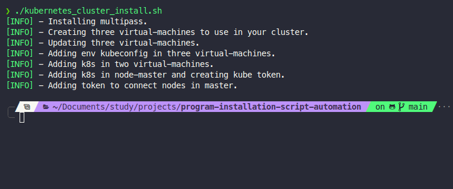

## How use?

- Add ppa and install Docker and Kubernetes and start kubernetes

---
---

### Create k8s cluster with multipass



```bash
git clone https://github.com/Claudio-code/script-to-install-kubernetes.git && cd ./script-to-install-kubernetes && sudo ./kubernetes_cluster_install.sh
```
